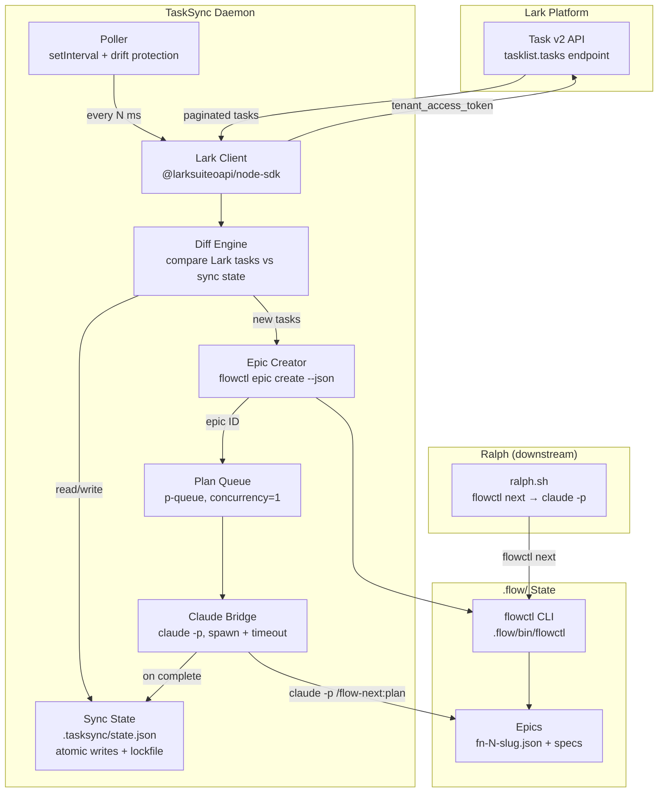

# Lark TaskSync Daemon

## Overview

A Node.js daemon that bridges Lark (ByteDance) task management with flow-next epic planning. It polls configured Lark tasklists on a user-controlled interval (default 5 minutes), diffs against local sync state, creates flow-next epics for new tasks, and triggers `claude -p "/flow-next:plan <epic-id>"` automatically. TaskSync populates the backlog; Ralph (or manual `/flow-next:work`) consumes it.

## Scope

**In scope:**
- Poll Lark Task v2 API for tasks in configured tasklists
- Persistent sync state mapping Lark task GUIDs to flow-next epic IDs
- Automatic epic creation via `flowctl epic create`
- Automatic plan generation via `claude -p` in headless mode
- Configurable polling interval, concurrency, and tasklist selection
- CLI for daemon control (start, stop, status, discover tasklists)
- Graceful shutdown, signal handling, health monitoring
- README, .env.example, and project documentation

**Out of scope (deferred):**
- Bidirectional sync (flow-next -> Lark)
- Lark task update/deletion sync (only initial creation)
- WebSocket/event-based real-time sync
- Docker containerization
- Web UI or API server

## Architecture



## Data Flow

1. **Poll**: Poller triggers LarkClient at configured interval
2. **Fetch**: LarkClient uses `tasklist.tasks` endpoint with `tenant_access_token` (auto-refreshed by SDK), paginates through all tasks
3. **Diff**: Differ compares fetched task GUIDs against `sync-state.json`. New tasks = not in state file
4. **Create Epic**: For each new task, `flowctl epic create --title "<lark_summary>"` returns epic ID
5. **Queue Plan**: Epic ID + Lark task context enqueued in PlanQueue (p-queue, concurrency configurable)
6. **Plan**: ClaudeBridge spawns `claude -p "/flow-next:plan <epic-id>"` with Lark description as context
7. **Update State**: On plan completion, state entry updated to `synced`. On failure, `failure_count` incremented.

## Sync State Schema

```json
{
  "version": 1,
  "last_poll": "2026-03-04T12:00:00Z",
  "tasks": {
    "<lark_task_guid>": {
      "epic_id": "fn-1-lark-tasksync-daemon",
      "lark_summary": "Task title from Lark",
      "lark_updated_at": "2026-03-04T11:55:00Z",
      "sync_status": "synced|pending_epic|pending_plan|failed|skipped",
      "last_sync_attempt": "2026-03-04T12:00:00Z",
      "failure_count": 0,
      "created_at": "2026-03-04T12:00:00Z"
    }
  }
}
```

Location: `.tasksync/state.json` (separate from `.flow/` to avoid git tracking conflicts).

## Configuration

Layered: env vars > `.tasksync/config.json` > defaults.

| Key | Env Var | Default | Description |
|-----|---------|---------|-------------|
| `lark.appId` | `LARK_APP_ID` | required | Lark app ID |
| `lark.appSecret` | `LARK_APP_SECRET` | required | Lark app secret |
| `lark.domain` | `LARK_DOMAIN` | `lark` | `lark` or `feishu` |
| `lark.tasklistGuids` | `LARK_TASKLIST_GUIDS` | required | Comma-separated tasklist GUIDs |
| `poll.intervalMs` | `TASKSYNC_POLL_INTERVAL_MS` | `300000` | Poll interval in ms (5 min) |
| `plan.concurrency` | `TASKSYNC_PLAN_CONCURRENCY` | `1` | Max parallel `claude -p` |
| `plan.timeoutMs` | `TASKSYNC_PLAN_TIMEOUT_MS` | `1800000` | Per-plan timeout (30 min) |
| `plan.maxRetries` | `TASKSYNC_PLAN_MAX_RETRIES` | `3` | Max retries per task |
| `plan.claudeArgs` | `TASKSYNC_CLAUDE_ARGS` | `""` | Extra args for `claude -p` |
| `flowctl.path` | `FLOWCTL_PATH` | `.flow/bin/flowctl` | Path to flowctl |

## Alternatives Considered

| Alternative | Why Not |
|-------------|---------|
| **WebSocket events instead of polling** | Lark task events (`task.task.updated_v1`) only fire for tasks created by the app, not human-created tasks. Polling is required for human-created tasks. |
| **Python instead of Node.js** | Lark's official Node SDK is more mature with TypeScript types, auto-pagination iterators, and built-in token management. Node.js v22 is available. |
| **Import flowctl as Python module** | flowctl.py is a 258KB single-file CLI, not designed as a library. Shell out to it with `--json` flag. |
| **Use Lark MCP server** | The `@larksuiteoapi/lark-mcp` is MCP-only, not usable as a regular Node.js library. Direct SDK gives more control. |
| **Bidirectional sync** | Dramatically increases complexity (conflict resolution, merge semantics). One-directional Lark→flow-next is sufficient for the use case. |
| **Single monolithic script** | A TypeScript project with proper modules enables testing, IDE support, and maintainability. |

## Non-Functional Targets

- **Reliability**: Graceful shutdown on SIGTERM/SIGINT, no zombie `claude` processes, atomic state writes
- **Resumability**: Daemon restart picks up where it left off via persistent sync state
- **Observability**: Structured logging (stdout), health file with last-poll timestamp
- **Resource usage**: Memory < 200MB idle, CPU near-zero between polls
- **Latency**: New Lark task → epic with plan within `poll_interval + plan_time` (typically < 40 min)

## Rollout Plan

1. **Phase 1**: Project scaffolding + Lark client + tasklist discovery CLI
2. **Phase 2**: Sync engine (polling, diffing, state management, epic creation)
3. **Phase 3**: Claude planning bridge (headless invocation, queue, retry)
4. **Phase 4**: Daemon lifecycle (signals, PID file, CLI commands, config reload)
5. **Phase 5**: Documentation + integration testing

## Risks & Mitigations

| Risk | Likelihood | Impact | Mitigation |
|------|-----------|--------|------------|
| Lark `tasklist.tasks` requires section_guid, not tasklist_guid | Medium | Blocks polling | Discovery CLI + clear docs on how to find the right GUID |
| `claude -p` doesn't load project plugins | Medium | `/flow-next:plan` unavailable | Test early; fallback to direct flowctl + manual planning |
| Lark rate limiting on frequent polls | Low | Sync delays | 5-min default interval is conservative; exponential backoff on 429 |
| Claude API quota exhaustion | Medium | Plans stop | Configurable concurrency, max retries, skip-after-N-failures |
| CJK/emoji in Lark task titles | Medium | Garbled epic slugs | flowctl handles this via `generate_epic_suffix()` fallback |
| Concurrent daemon instances | Low | Duplicate epics | PID file + lockfile on state |

## Quick commands

```bash
# Start daemon
npx tsx src/cli.ts start

# Check status
npx tsx src/cli.ts status

# Stop daemon
npx tsx src/cli.ts stop

# Discover Lark tasklists
npx tsx src/cli.ts discover

# One-shot sync (no daemon)
npx tsx src/cli.ts sync-once

# Run tests
npm test
```

## Acceptance Criteria

- [ ] Daemon polls Lark tasklist(s) at configurable interval
- [ ] New Lark tasks automatically create flow-next epics via flowctl
- [ ] `claude -p "/flow-next:plan <epic-id>"` triggered for each new epic
- [ ] Sync state persists across daemon restarts (`.tasksync/state.json`)
- [ ] No duplicate epics for the same Lark task on re-sync
- [ ] Graceful shutdown: no zombie claude processes, state saved
- [ ] CLI commands: start, stop, status, discover, sync-once
- [ ] Configurable via env vars and config file
- [ ] README.md with setup instructions
- [ ] .env.example with all required variables
- [ ] Integration test demonstrating full sync cycle (mocked Lark API)

## References

- [Lark Node SDK](https://github.com/larksuite/node-sdk) — Official SDK with auto-pagination and token management
- [Lark Task v2 API](https://open.larksuite.com/document/uAjLw4CM/ukTMukTMukTM/task-v2/task/overview) — Task endpoints (client-rendered docs)
- [Lark OpenAPI MCP](https://github.com/larksuite/lark-openapi-mcp) — Typed Zod schemas for all endpoints (source of truth for API shapes)
- [Claude Code Headless Mode](https://code.claude.com/docs/en/headless) — `claude -p` programmatic usage
- [Ralph Docs](https://github.com/gmickel/gmickel-claude-marketplace/blob/main/plugins/flow-next/docs/ralph.md) — Autonomous loop architecture
- [flowctl CLI](https://github.com/gmickel/gmickel-claude-marketplace/blob/main/plugins/flow-next/docs/flowctl.md) — All CLI commands with --json
- `.flow/bin/flowctl.py:2704-2768` — `cmd_epic_create` implementation
- `.flow/bin/flowctl.py:3070-3131` — `cmd_epics` JSON output format
- `.flow/bin/flowctl.py:368-380` — JSON output convention
